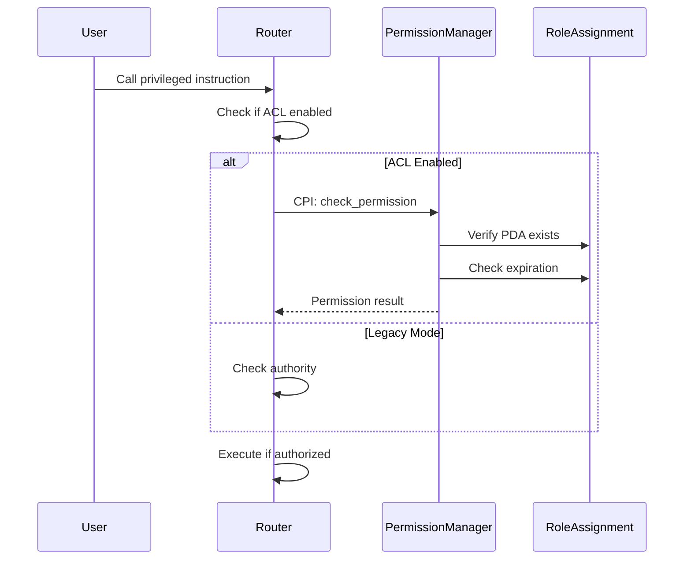

# ADR-002: Solana Router Access Control List (ACL) Design - Permission Manager Pattern

## Context
The Solana ICS26 router requires role-based access control (RBAC) to enable multi-party operation and achieve feature parity with the Ethereum implementation, which uses OpenZeppelin's AccessManager. This ADR proposes an ACL design using a **Permission Manager Pattern** where access control is managed by a separate, dedicated program rather than embedded within the router. This separation of concerns provides better modularity, reusability, and upgradability.

## Decision

### Design Principles
1. **Separation of Concerns**: ACL logic is isolated in a dedicated Permission Manager program, not embedded in the router
2. **Reusability**: The Permission Manager can be used by multiple IBC programs (router, ICS20Transfer, etc.)
3. **Compatibility**: Maintain backwards compatibility with existing single-authority model during migration
4. **Rent Efficiency**: Minimize account rent and computation costs typical in Solana programs
5. **Feature Parity**: Support similar roles to Ethereum implementation where applicable
6. **Solana Native**: Leverage Program Derived Addresses (PDAs) for deterministic account derivation
7. **Upgradability**: Permission Manager can be upgraded independently of the router

### Proposed Architecture

#### Overview: Permission Manager Pattern
The ACL system is implemented as a **separate Permission Manager program** that:
- Manages all role assignments and permissions centrally
- Provides CPI (Cross-Program Invocation) interfaces for permission checks
- Can be shared across multiple IBC programs
- Supports program-specific role namespacing

```
┌─────────────────┐         CPI         ┌────────────────────┐
│   ICS26 Router  │──────────────────►  │ Permission Manager │
└─────────────────┘                      └────────────────────┘
        ▲                                         ▼
        │                                   ┌──────────┐
        │                                   │ ACL Data │
        │                                   └──────────┘
┌─────────────────┐         CPI         ┌────────────────────┐
│ ICS20 Transfer  │──────────────────►  │ Permission Manager │
└─────────────────┘                      └────────────────────┘
```

#### 1. Role Definitions
Roles are namespaced by program to prevent conflicts:

##### Router-specific roles:
- **router:admin** - Manage router roles and upgrade router (maps to `ADMIN_ROLE`)
- **router:relayer** - Relay packets (recv, ack, timeout) and update clients (maps to `RELAYER_ROLE`)
- **router:id_customizer** - Add IBC apps and clients with custom IDs (maps to `ID_CUSTOMIZER_ROLE`)

##### ICS20Transfer-specific roles:
- **ics20:admin** - Manage ICS20 roles and upgrade
- **ics20:pauser** - Pause operations (maps to `PAUSER_ROLE`)
- **ics20:unpauser** - Unpause operations (maps to `UNPAUSER_ROLE`)
- **ics20:delegate_sender** - Call sendTransferWithSender (maps to `DELEGATE_SENDER_ROLE`)
- **ics20:rate_limiter** - Set rate limits (maps to `RATE_LIMITER_ROLE`)
- **ics20:erc20_customizer** - Set custom token contracts (maps to `ERC20_CUSTOMIZER_ROLE`)

Roles use a namespace:role format for clarity:
 e.g., "router:admin", "router:relayer", "ics20:pauser"

#### 2. Account Structure

##### Permission Manager Program Accounts

###### PermissionManagerState (Global PDA)
```rust
#[account]
pub struct PermissionManagerState {
    pub super_admin: Pubkey,     // Super admin who can register programs
    pub pending_super_admin: Option<Pubkey>, // For 2-step transfer
    pub programs_registered: u32, // Counter of registered programs
    pub bump: u8,                // PDA bump seed
}
// Seeds: [b"permission_manager"]
```

###### ProgramRegistry (PDA per program)
```rust
#[account]
pub struct ProgramRegistry {
    pub program_id: Pubkey,      // The program being managed
    pub admin: Pubkey,           // Admin for this program's permissions
    pub pending_admin: Option<Pubkey>, // For 2-step admin transfer
    pub namespace: String,       // e.g., "router", "ics20"
    pub active: bool,            // Whether this program is active
    pub registered_at: i64,      // Unix timestamp
    pub bump: u8,                // PDA bump seed
}
// Seeds: [b"program_registry", program_id.as_ref()]
```

###### RoleAssignment (PDA)
```rust
#[account]
pub struct RoleAssignment {
    pub program_registry: Pubkey, // Parent program registry
    pub grantee: Pubkey,         // Address with the role
    pub role: String,            // Namespaced role (e.g., "router:relayer")
    pub granted_at: i64,         // Unix timestamp of grant
    pub expires_at: Option<i64>, // Optional expiration timestamp
    pub bump: u8,                // PDA bump seed
}
// Seeds: [b"role_assignment", program_registry.key(), grantee.as_ref(), role.as_bytes()]
```

##### Updated Router Accounts

###### RouterState (simplified)
```rust
#[account]
pub struct RouterState {
    pub authority: Pubkey,       // Legacy field for backwards compatibility
    pub permission_manager: Option<Pubkey>, // Permission Manager program ID
    pub acl_enabled: bool,       // Toggle between legacy and ACL mode
}
```

###### RouterPermissionConfig (PDA)
```rust
#[account]
pub struct RouterPermissionConfig {
    pub router: Pubkey,          // Associated router
    pub permission_manager: Pubkey, // Permission Manager program
    pub namespace: String,       // "router"
    pub bump: u8,                // PDA bump seed
}
// Seeds: [b"router_permission_config", router.key()]
```

#### 3. Core Instructions

##### Permission Manager Program Instructions

###### System Management
- `initialize` - Initialize the Permission Manager with super admin
- `register_program` - Register a new program with its namespace
- `deactivate_program` - Deactivate a program (emergency)
- `propose_super_admin_transfer` - Initiate super admin transfer
- `accept_super_admin_transfer` - Accept super admin role

###### Program-Level Management
- `propose_program_admin_transfer` - Program admin initiates transfer
- `accept_program_admin_transfer` - Accept program admin role
- `update_program_config` - Update program configuration

###### Role Management
- `grant_role` - Program admin grants role to an address
- `grant_role_with_expiry` - Grant role with expiration time
- `grant_roles_batch` - Grant multiple roles atomically
- `revoke_role` - Program admin revokes role
- `revoke_all_roles` - Emergency revocation for a grantee
- `renew_role` - Extend expiration of existing role

###### Permission Checking (CPI)
- `check_permission` - Verify if address has specific role
- `check_any_permission` - Verify if address has any of specified roles
- `get_roles` - Query all roles for an address

##### Router Program Instructions (Updated)

###### ACL Integration
- `enable_permission_manager` - Migrate from authority to Permission Manager
- `disable_permission_manager` - Emergency fallback to authority mode
- `update_permission_config` - Update Permission Manager configuration

###### Modified Existing Instructions
All privileged instructions now include permission checks via CPI:
```rust
// Example: add_ibc_app instruction
pub fn add_ibc_app(ctx: Context<AddIBCApp>, ...) -> Result<()> {
    // If ACL enabled, check permission via CPI
    if ctx.accounts.router_state.acl_enabled {
        permission_manager::cpi::check_permission(
            ctx.accounts.permission_manager_ctx(),
            "router:id_customizer".to_string(),
            ctx.accounts.signer.key(),
        )?;
    } else {
        // Legacy authority check
        require!(ctx.accounts.signer.key() == ctx.accounts.router_state.authority);
    }
    // ... rest of logic
}
```

#### 4. Permission Model

##### Permission Checking Flow


##### Role Verification
```rust
pub enum PermissionError {
    ProgramNotRegistered,
    ProgramInactive,
    RoleNotFound,
    InsufficientPermissions,
    RoleExpired,
    InvalidNamespace,
    AdminTransferPending,
    NotPendingAdmin,
}
```

##### Permission Caching
To optimize repeated permission checks within a transaction:
```rust
#[account]
pub struct PermissionCache {
    pub tx_signature: [u8; 64],  // Current transaction signature
    pub grantee: Pubkey,
    pub cached_roles: Vec<String>,
    pub cache_expires: i64,      // Short TTL (e.g., 30 seconds)
}
```

##### Role Hierarchy and Inheritance
- No implicit permission inheritance between roles
- Super admin can only manage program registrations, not grant program-specific roles
- Program admins manage their own namespace only
- Explicit role checks for each operation
- Optional role groups can be defined at the program level

### Security Considerations

1. **Program Isolation**: Each program's permissions are isolated by namespace
2. **CPI Security**: Permission Manager validates caller program ID to prevent spoofing
3. **Role Enumeration**: Support efficient querying via getProgramAccounts filters
4. **Emergency Recovery**:
   - Super admin can deactivate compromised programs
   - Programs can fall back to legacy authority mode
   - Permission Manager itself can be upgraded by super admin
5. **Upgrade Persistence**: Role assignments persist through program upgrades via PDAs
6. **Audit Trail**: Comprehensive events for all permission changes
7. **Two-Step Admin Transfer**: Required for both super admin and program admins
8. **Expiration Support**: Roles can have optional expiration timestamps
9. **Reentrancy Protection**: Permission checks are idempotent and stateless

### Cost Analysis

#### Storage Costs (Permission Manager)
- `PermissionManagerState`: ~0.0014 SOL (one-time)
- `ProgramRegistry`: ~0.0020 SOL per program
- `RoleAssignment`: ~0.0022 SOL per assignment
- `PermissionCache`: ~0.0025 SOL (optional, per active user)

#### Storage Costs (Router)
- `RouterPermissionConfig`: ~0.0015 SOL (one-time)
- No additional storage for role data (stored in Permission Manager)

#### Typical Setup Example
- Permission Manager initialization: ~0.0014 SOL
- Register 2 programs (router, ICS20): ~0.0040 SOL
- Grant 10 roles across programs: ~0.0220 SOL
- **Total**: ~0.0274 SOL

#### Operational Costs
- CPI overhead: ~3,000 compute units per permission check
- Cached permission checks: ~500 compute units
- Still orders of magnitude cheaper than Ethereum
- No ongoing gas costs unlike Ethereum

### Trade-offs

#### Pros
- **Separation of concerns** - ACL logic isolated from business logic
- **Reusability** - Single Permission Manager for multiple programs
- **Independent upgradability** - Permission Manager and programs can upgrade separately
- Granular permissions with multi-party support
- Clear migration path from single-authority
- On-chain audit trail with timestamps
- **Extensible role system** - New roles added without program upgrades
- **Namespace isolation** - Prevents role conflicts between programs
- **Expiration support** - Time-bound permissions
- Significantly lower costs than Ethereum

#### Cons
- **CPI overhead** - Additional ~3,000 compute units per check
- **Deployment complexity** - Requires deploying separate Permission Manager
- Additional account rent (~0.03 SOL for typical multi-program setup)
- Increased transaction size for permission accounts
- More complex than single-authority model
- Requires off-chain indexing for role enumeration
- No built-in timelock (would require another separate program)
- **String-based roles** use more storage than enums
- **Extra dependency** - Programs depend on Permission Manager availability

### Alternative Approaches Considered

1. **Embedded ACL in Router**: Simpler but couples ACL logic with business logic, harder to reuse
2. **Fixed Array in RouterState**: More efficient for small role sets but lacks flexibility
3. **Merkle Tree Roles**: Rejected due to off-chain proof requirements
4. **Single Shared ACL for All Programs**: Rejected due to lack of namespace isolation
5. **NFT-based Roles**: Rejected due to complexity and transfer risks

## Feature Comparison with Ethereum

### Supported Features
✅ Role-based access control with multiple roles
✅ Admin role management (grant/revoke)
✅ Relayer permissions for packet relay
✅ ID customization for ports and clients
✅ Pause/unpause functionality
✅ Client migration permissions
✅ Backwards compatibility
✅ Batch role operations
✅ Two-step admin transfer

### Not Supported / Different Approach
❌ Time-delayed operations (requires separate timelock program)
❌ Guardian role for canceling operations
❌ Per-function granularity (Solana uses per-instruction)
❌ Automatic permission modifiers
❌ ICS20-specific roles (separate ADR needed)


## Consequences

### Positive
- **Clean separation** of permission logic from business logic
- **Reusable** permission system for entire IBC ecosystem
- **Independent evolution** of Permission Manager and IBC programs
- Achieves core RBAC parity with Ethereum
- Enables secure multi-party operation
- Maintains Solana best practices
- Provides extensible foundation for future enhancements
- **Better testing** - Permission logic can be tested independently

### Negative
- **Additional program deployment** required
- **CPI overhead** on every permission check (~3,000 compute units)
- Increases complexity for operators
- Requires careful migration planning
- Lacks advanced timelock features without additional infrastructure
- **Dependency risk** - Permission Manager becomes critical infrastructure

### Neutral
- Requires relayer software updates to handle CPI accounts
- Documentation and tooling updates needed
- Monitoring needed for Permission Manager availability
- Consider permission caching for high-frequency operations

## References
- [Ethereum IBCRolesLib Implementation](../../contracts/utils/IBCRolesLib.sol)
- [OpenZeppelin AccessManager](https://docs.openzeppelin.com/contracts/5.x/api/access#AccessManager)
- [Solana PDA Documentation](https://docs.solana.com/developing/programming-model/calling-between-programs#program-derived-addresses)
