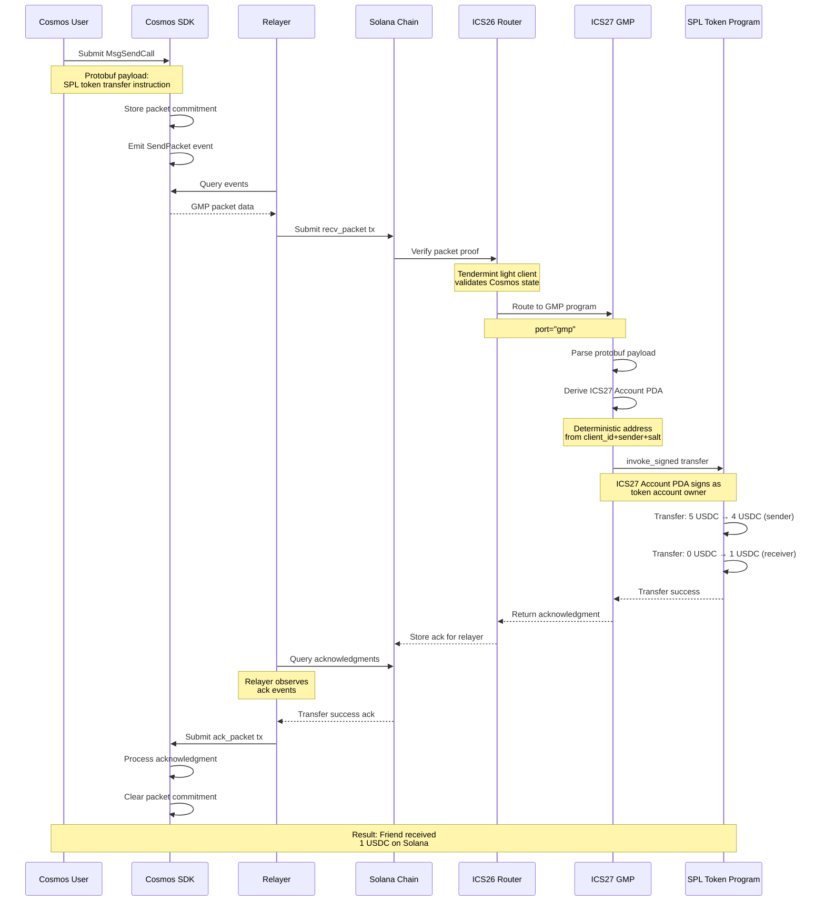

# ADR: ICS27 General Message Passing (GMP) Architecture for Solana

**Status**: Proposed
**Date**: 2025-09-18

## Context

The ICS27 General Message Passing (GMP) protocol enables cross-chain smart contract execution by allowing users on one blockchain to trigger contract calls on another blockchain through IBC packets. An existing Ethereum implementation serves as the reference, using a two-contract architecture with unlimited call depth.

Solana's execution model presents unique constraints that require architectural adaptations:

1. **CPI Depth Limitation**: Solana enforces a maximum of 4 Cross-Program Invocation (CPI) calls per transaction
2. **Account Model**: Solana uses Program Derived Addresses (PDAs) instead of deployable contracts for deterministic addresses
3. **Account Pre-declaration**: All accounts accessed during execution must be declared upfront
4. **Typed Addresses**: Solana uses typed `Pubkey` instead of string addresses

The reference Ethereum implementation uses:

```
User → GMP Contract → Account Contract → Target Contract → Unlimited subcalls
```

This architecture would consume 3 of Solana's 4 available CPI levels before target programs can execute, severely limiting the complexity of cross-chain operations.

## Decision

We will implement a **flattened single-program architecture** for ICS27 GMP on Solana that maximizes available CPI depth for target programs while maintaining functional equivalence with the Ethereum implementation.

### Key Architectural Choices

1. **Single Program Design**: Merge GMP logic and account management into one program
2. **PDA-Based Accounts**: Use deterministic PDAs instead of deployed contracts
3. **Direct Execution**: Execute target programs directly via `invoke_signed`
4. **Enhanced Payload Structure**: Extended payload format to handle Solana's account requirements

## Architecture

### Solana GMP Architecture

**Flattened Design:**

```
Transaction → Router → GMP Program → Target Program → Sub-programs (max 2 levels)
```

**Program Structure:**

```rust
#[program]
pub mod ics27_gmp {
    pub fn initialize(ctx: Context<Initialize>, router_program: Pubkey, port_id: String) -> Result<()>
    pub fn send_call(ctx: Context<SendCall>, msg: SendCallMsg) -> Result<u64>
    pub fn on_recv_packet(ctx: Context<OnRecvPacket>) -> Result<Vec<u8>>
    pub fn on_ack_packet(ctx: Context<OnAckPacket>) -> Result<()>
    pub fn on_timeout_packet(ctx: Context<OnTimeoutPacket>) -> Result<()>
}
```

### Account Management

**Deterministic Cross-Chain Identity:**

The ICS27 Account PDA serves as a deterministic identity that can sign transactions on behalf of the Cosmos user:

```rust
impl AccountState {
    pub fn derive_address(
        client_id: &str,        // Source chain identifier
        sender: &str,           // Original sender address
        salt: &[u8],           // User-provided uniqueness
        program_id: &Pubkey,
    ) -> Result<(Pubkey, u8)> {
        let (address, bump) = Pubkey::find_program_address(&[
            ACCOUNT_STATE_SEED,    // b"gmp-account"
            client_id.as_bytes(),
            sender.as_bytes(),
            salt,
        ], program_id);
        Ok((address, bump))
    }
}
```

**Key Properties:**

- Deterministic: Same Cosmos user always gets the same Solana PDA
- Acts as signing authority for cross-chain operations
- Can own token accounts and other assets
- Only the GMP program can make it sign via `invoke_signed`
- No deployment costs - address exists before first use

**PDA-Authorized Execution:**

```rust
// GMP program executes with ICS27 Account PDA as signer
let result = invoke_signed(
    &target_instruction,
    &remaining_accounts,  // All accounts must be provided by Cosmos user
    &[&[
        b"gmp-account",
        packet_data.client_id.as_bytes(),
        packet_data.sender.as_bytes(),
        &packet_data.salt,
        &[bump]
    ]]
)?;
```

### Protobuf Payload Structure

**Note on Solana's Account Model:** Unlike Ethereum where you only need a target address and calldata, Solana requires all accounts that will be accessed during execution to be declared upfront. This complexity is inherent to Solana's parallel execution model and cannot be abstracted away.

**Cross-Chain Compatible Protobuf Messages:**

```proto
// solana_instruction.proto
message SolanaInstruction {
  bytes program_id = 1;                           // Target Solana program (32 bytes)
  repeated SolanaAccountMeta accounts = 2;        // ALL accounts that will be accessed
  bytes data = 3;                                 // Instruction data
}

message SolanaAccountMeta {
  bytes pubkey = 1;                               // Account public key (32 bytes)
  bool is_signer = 2;                            // Will ICS27 Account PDA sign for this account?
  bool is_writable = 3;                          // Will this account be modified?
}
```

**Rust Implementation:**

```rust
// Generated from protobuf
#[derive(Clone, PartialEq, ::prost::Message)]
pub struct SolanaInstruction {
    #[prost(bytes, tag="1")]
    pub program_id: Vec<u8>,
    #[prost(message, repeated, tag="2")]
    pub accounts: Vec<SolanaAccountMeta>,
    #[prost(bytes, tag="3")]
    pub data: Vec<u8>,
}
```

**Packet Data Structure:**

```rust
pub struct GMPPacketData {
    pub client_id: String,  // For PDA derivation
    pub sender: String,     // Source chain sender address
    pub salt: Vec<u8>,      // For account uniqueness
    pub payload: Vec<u8>,   // Protobuf-encoded SolanaInstruction
    pub memo: String,       // Optional metadata
}
```

## Cross-Chain Flow Example

### SPL Token Transfer (Cosmos → Solana)

**Scenario**: Cosmos SDK user transfers SPL tokens owned by their ICS27 Account PDA to another Solana address

```
┌─────────────────┐    ┌─────────────────┐    ┌─────────────────┐
│   Cosmos SDK    │───▶│     Relayer     │───▶│     Solana      │
│                 │    │  (Pass-through) │    │                 │
│ 1. User submits │    │ 2. Observes &   │    │ 3. Executes SPL │
│    GMP packet   │    │    relays packet│    │    transfer     │
└─────────────────┘    └─────────────────┘    └─────────────────┘
```

#### Phase 1: Cosmos Transaction Initiation

**User constructs SPL Token Transfer:**

```go
import (
    "github.com/gagliardetto/solana-go/programs/token"
    solanago "github.com/gagliardetto/solana-go"
)

// Helper to convert solana-go AccountMeta to protobuf format
func convertAccountMetas(accounts []*solanago.AccountMeta) []*pb.SolanaAccountMeta {
    result := make([]*pb.SolanaAccountMeta, len(accounts))
    for i, acc := range accounts {
        result[i] = &pb.SolanaAccountMeta{
            Pubkey:     acc.PublicKey.Bytes(),
            IsSigner:   acc.IsSigner,
            IsWritable: acc.IsWritable,
        }
    }
    return result
}

// User creates protobuf payload for SPL token transfer using instruction builder
transferInstruction := token.NewTransferInstruction(
    1_000_000,               // amount: 1 USDC (1,000,000 with 6 decimals)
    userTokenAccount,        // source: token account owned by ICS27 Account PDA
    receiverTokenAccount,    // destination: receiver's token account
    ics27AccountPda,         // owner: ICS27 Account PDA (will sign via invoke_signed)
).Build()

splInstruction := &pb.SolanaInstruction{
    ProgramId: transferInstruction.ProgramID().Bytes(),
    Accounts:  convertAccountMetas(transferInstruction.Accounts()),
    Data:      transferInstruction.Data(), // Automatically encoded: [0x03, 0x40, 0x42, 0x0F, 0x00, 0x00, 0x00, 0x00, 0x00]
}

// Serialize to protobuf bytes
payloadBytes, err := proto.Marshal(splInstruction)

// Submit GMP packet
msg := &gmptypes.MsgSendCall{
    SourceClient:     "07-tendermint-0",
    Sender:           "cosmos1user1234567890abcdef1234567890abcdef12",
    Salt:             []byte{1, 2, 3, 4},
    Payload:          payloadBytes,  // Protobuf-encoded SolanaInstruction
    TimeoutTimestamp: uint64(time.Now().Add(1 * time.Hour).Unix()),
    Memo:             "Transfer 1 USDC to friend",
    Encoding:         "protobuf",
}
```

#### Phase 2: Relayer (Pass-Through)

```
┌─────────────────┐     ┌─────────────────┐     ┌─────────────────┐
│  Cosmos Chain   │────▶│     Relayer     │────▶│  Solana Chain   │
│ ┌─────────────┐ │     │                 │     │ ┌─────────────┐ │
│ │GMP Packet   │ │     │ • Observes      │     │ │GMP Packet   │ │
│ │(protobuf)   │ │     │ • Extracts      │     │ │(unchanged)  │ │
│ └─────────────┘ │     │ • Forwards      │     │ └─────────────┘ │
└─────────────────┘     └─────────────────┘     └─────────────────┘
```

Relayer observes Cosmos for GMP packets and delivers them unchanged to Solana. No payload transformation occurs.

#### Phase 3: Solana Execution (GMP Program)

**Visual Flow Diagram:**

```
                    Solana Transaction Execution

┌─────────────────┐    ┌─────────────────┐    ┌─────────────────┐
│   ICS26 Router  │───▶│   ICS27 GMP     │───▶│  SPL Token      │
│                 │    │                 │    │  Program        │
│ • Verifies      │    │ • Parses packet │    │                 │
│   packet proof  │    │ • Creates PDA   │    │ • Executes      │
│ • Routes to GMP │    │ • invoke_signed │    │   transfer      │
└─────────────────┘    └─────────────────┘    └─────────────────┘
        │                        │                        │
        ▼                        ▼                        ▼
   Proof Valid              PDA Signs              1 USDC Transferred
```

**SPL Token Account Setup:**

```rust
// 1. ICS27 Account PDA (owns the SPL tokens)
let (ics27_account_pda, bump) = Pubkey::find_program_address(&[
    b"gmp-account",
    b"07-tendermint-0",  // client_id (Cosmos chain)
    b"cosmos1user1234567890abcdef1234567890abcdef12",  // Cosmos sender
    &[1, 2, 3, 4]  // user's salt
], &gmp_program_id);

// 2. Source SPL Token Account (owned by ICS27 Account PDA)
let source_token_account = get_associated_token_address(
    &ics27_account_pda,    // Owner: ICS27 Account PDA
    &usdc_token_contract   // Token contract: USDC
);

// 3. Destination SPL Token Account (receiver's)
let dest_token_account = get_associated_token_address(
    &receiver_address,     // Owner: Friend's wallet
    &usdc_token_contract   // Token contract: USDC
);

// The ICS27 Account PDA must sign the transfer since it owns the source token account
```

**GMP Execution on Solana:**

```rust
pub fn on_recv_packet(ctx: Context<OnRecvPacket>) -> Result<Vec<u8>> {
    // 1. Parse packet data from IBC router
    let packet_data = parse_gmp_packet_data(&router_msg)?;

    // 2. Derive ICS27 Account PDA that will act as the signer
    let (ics27_pda, bump) = derive_ics27_address(
        &packet_data.client_id,    // "07-tendermint-0" (Cosmos chain)
        &packet_data.sender,       // "cosmos1user1234567890abcdef1234567890abcdef12"
        &packet_data.salt,         // [1, 2, 3, 4]
        ctx.program_id,
    )?;

    // 3. Parse protobuf payload (contains all required accounts)
    let solana_instruction = SolanaInstruction::decode(&packet_data.payload[..])?;

    // 4. Convert protobuf accounts to Solana AccountMeta
    let account_metas: Vec<AccountMeta> = solana_instruction.accounts
        .iter()
        .map(|account| AccountMeta {
            pubkey: Pubkey::try_from(account.pubkey.as_slice()).unwrap(),
            is_signer: account.is_signer,
            is_writable: account.is_writable,
        })
        .collect();

    // 5. Execute SPL token transfer with ICS27 Account PDA authority
    let result = invoke_signed(
        &Instruction {
            program_id: Pubkey::try_from(solana_instruction.program_id.as_slice())?,
            accounts: account_metas,
            data: solana_instruction.data,  // SPL transfer instruction data
        },
        &remaining_accounts,  // Source token account, dest token account, etc.
        &[&[
            b"gmp-account",
            packet_data.client_id.as_bytes(),
            packet_data.sender.as_bytes(),
            &packet_data.salt,
            &[bump]
        ]]
    )?;

    // 6. Create success acknowledgment
    let ack = GMPAcknowledgement::success(b"1 USDC transferred successfully".to_vec());
    Ok(ack.try_to_vec()?)
}
```

**Solana State After Execution:**

- Source token account: 5 USDC → 4 USDC
- Destination token account: 0 USDC → 1 USDC
- ICS27 account state: nonce incremented
- Acknowledgment stored for relayer pickup
- Event emitted: `GMPTokenTransferCompleted`

#### Phase 4: Acknowledgment Flow Back to Cosmos

The relayer observes Solana for execution acknowledgments and delivers them back to Cosmos, completing the cross-chain flow.

**Complete Flow Sequence Diagram:**



## Relayer Architecture

Relayers are pass-through infrastructure that extract packets from source chains and deliver them unchanged to destination chains. The existing `cosmos-to-solana` relayer automatically routes GMP packets to the ICS27 program without requiring modifications.

## Security Considerations

### Account Control Model

**Equivalent Security to Ethereum:**

- Ethereum: Account contracts have `onlyICS27` modifier restricting access to GMP contract
- Solana: PDA accounts controlled exclusively by GMP program via `invoke_signed`

Both models ensure users cannot directly control their accounts - only the GMP system can execute on their behalf.

### Replay Protection

**Enhanced Nonce System:**

```rust
pub struct AccountState {
    pub nonce: u64,                    // Prevents replay attacks
    pub frozen: bool,                  // Admin emergency control
    pub execution_count: u64,          // Audit trail
    pub last_executed_at: i64,         // Temporal tracking
    // ...
}
```

## References

- [Solana Program Derived Addresses](https://docs.solana.com/developing/programming-model/calling-between-programs#program-derived-addresses)
- [Anchor Framework Documentation](https://book.anchor-lang.com/)
- [Ethereum ICS27 Reference Implementation](https://github.com/cosmos/solidity-ibc-eureka/tree/serdar/xxx-contract-calls)
