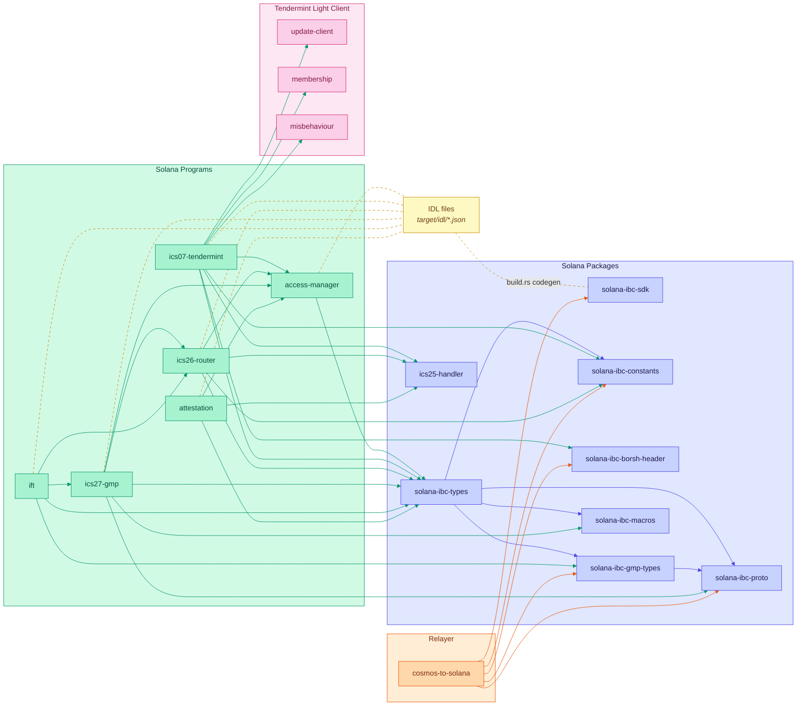

# Solana IBC Programs

This directory contains the Solana implementation of IBC Eureka protocol, built using the Anchor framework. The programs enable trust-minimized interoperability between Solana and Cosmos SDK chains.

## Dependency Graph



### Generate Keypairs for a Cluster

```bash
just generate-solana-keypairs <cluster>
```

Where `<cluster>` is one of: `localnet`, `devnet`, `testnet`, `mainnet`

This creates keypairs in `solana-keypairs/<cluster>/`:

- `access_manager-keypair.json`
- `ics07_tendermint-keypair.json`
- `ics26_router-keypair.json`
- `ics27_gmp-keypair.json`
- `test_ibc_app-keypair.json`
- `mock_light_client-keypair.json`
- `deployer_wallet.json`

### Manual Keypair Generation

```bash
# Generate a program keypair
solana-keygen new -o solana-keypairs/<cluster>/<program>-keypair.json

# Display the public key (program ID)
solana-keygen pubkey solana-keypairs/<cluster>/<program>-keypair.json
```

**Security Notes:**

- Keypairs for `devnet`, `testnet`, and `mainnet` are **automatically gitignored**
- Only `localnet` keypairs are committed to the repository
- **Never commit production keypairs to version control**
- Store production keypairs securely

## Deployment

### Quick Deployment

Deploy to devnet with a single command:

```bash
just deploy-solana devnet
```

This automatically:

1. Builds programs with cluster-specific program IDs
2. Deploys all programs to the target cluster
3. Updates `Anchor.toml` with deployed program IDs

### Step-by-Step Deployment

#### 1. Fund Your Deployer Wallet

```bash
# Devnet (free airdrops)
solana airdrop 5 solana-keypairs/devnet/deployer_wallet.json --url devnet

# Testnet
solana airdrop 2 solana-keypairs/testnet/deployer_wallet.json --url testnet

# Mainnet (fund with real SOL)
solana transfer <DEPLOYER_PUBKEY> <AMOUNT> --from <YOUR_WALLET> --url mainnet
```

#### 2. Build Programs

```bash
just build-solana
```

This compiles all programs and generates their IDLs.

#### 3. Deploy Programs

```bash
cd programs/solana
anchor deploy --provider.cluster <cluster>
```

Or deploy individual programs:

```bash
anchor deploy -p access-manager --provider.cluster devnet
```

### Local Deployment (Testing)

For local development and testing:

```bash
# Terminal 1: Start local validator
solana-test-validator

# Terminal 2: Configure Solana CLI
solana config set --url localhost

# Terminal 3: Deploy
just deploy-solana localnet
```

### Deployment Options

#### Deploy Specific Programs

```bash
anchor deploy -p access-manager --provider.cluster devnet
anchor deploy -p ics26-router --provider.cluster devnet
```

#### Upgrade Existing Programs

```bash
# Build new version
just build-solana

# Deploy upgrade
anchor upgrade target/deploy/ics26_router.so \
  --program-id <PROGRAM_ID> \
  --provider.cluster devnet
```

**Note:** After initial deployment, program upgrades should use the AccessManager's upgrade mechanism (see [Program Upgradability](#program-upgradability)).

### Verifying Deployment

```bash
# Check program account
solana program show <PROGRAM_ID> --url devnet

# Verify program executable
solana account <PROGRAM_ID> --url devnet

# Check deployer balance
solana balance solana-keypairs/devnet/deployer_wallet.json --url devnet
```

## Access Control & Roles

The AccessManager provides role-based access control across all IBC programs.

### Role Definitions

| Role ID    | Name                 | Purpose                                 |
| ---------- | -------------------- | --------------------------------------- |
| `0`        | `ADMIN_ROLE`         | Root administrator with all permissions |
| `1`        | `RELAYER_ROLE`       | Submit IBC packets and client updates   |
| `2`        | `PAUSER_ROLE`        | Pause operations during emergencies     |
| `3`        | `UNPAUSER_ROLE`      | Resume operations after emergency       |
| `6`        | `ID_CUSTOMIZER_ROLE` | Customize client and connection IDs     |
| `u64::MAX` | `PUBLIC_ROLE`        | Anyone (unrestricted access)            |

**Note:** Some role IDs (4, 5, 7) are reserved for future use and Ethereum compatibility but not currently implemented on Solana.

### Role Management

#### Initialize AccessManager

Before granting roles, initialize the AccessManager with an initial admin:

```bash
just initialize-access-manager <cluster> <admin-pubkey>
```

Example:

```bash
just initialize-access-manager localnet 8ntLtUdGwBaXfFPCrNis9MWsKMdEUYyonwuw7NQwhs5z
```

This creates the AccessManager PDA and grants ADMIN_ROLE to the specified account.

#### Grant Role

Grant a role to an account:

```bash
just grant-solana-role <cluster> <role-id> <account-pubkey>
```

Example (grant RELAYER_ROLE):

```bash
just grant-solana-role localnet 1 8ntLtUdGwBaXfFPCrNis9MWsKMdEUYyonwuw7NQwhs5z
```

#### Revoke Role

Revoke a role from an account:

```bash
just revoke-solana-role <cluster> <role-id> <account-pubkey>
```

Example:

```bash
just revoke-solana-role localnet 1 8ntLtUdGwBaXfFPCrNis9MWsKMdEUYyonwuw7NQwhs5z
```

### Role Verification

Programs verify roles before executing sensitive operations:

```rust
use access_manager::helpers::require_role;

require_role(
    &access_manager_account,
    roles::RELAYER_ROLE,
    &authority_account,
    &instructions_sysvar,
    &program_id,
)?;
```

## Program Upgradability

Solana programs deployed via BPF Loader Upgradeable can be upgraded by the upgrade authority. We use AccessManager to manage upgrade permissions via role-based access control.

### Initial Setup

After deploying programs, configure upgrade authority management:

**Step 1: Initialize AccessManager (if not already done)**

```bash
just initialize-access-manager <cluster> <admin-pubkey>
```

Example:

```bash
just initialize-access-manager localnet 8ntLtUdGwBaXfFPCrNis9MWsKMdEUYyonwuw7NQwhs5z
```

**Step 2: Transfer upgrade authority to AccessManager PDA**

```bash
just set-upgrade-authority <program-id> <cluster> [current-authority-keypair]
```

Example:

```bash
just set-upgrade-authority FRGF7cthWUvDvAHMUARUHFycyUK2VDUtBchmkwrz7hgx localnet ~/.config/solana/id.json
```

**Notes:**

- The upgrade authority PDA is automatically derived with seeds: `["upgrade_authority", program_id]`
- The third parameter (current authority keypair) is optional - if omitted, the command will tell you which keypair you need
- Use `--skip-new-upgrade-authority-signer-check` is automatically applied since PDAs cannot sign

### Performing Upgrades

Once upgrade authority is transferred to AccessManager, upgrades require ADMIN_ROLE.

#### Complete Upgrade (Recommended)

Execute the entire upgrade process (build, buffer, and upgrade instruction) in one command:

```bash
just upgrade-solana-program <program-name> <program-id> <cluster> <upgrader-keypair-path>
```

Example:

```bash
just upgrade-solana-program ics26_router 4fMih2CidrXPeRx77kj3QcuBZwREYtxEbXjURUgadoe1 devnet solana-keypairs/devnet/upgrader.json
```

This command automatically:

1. Builds the new program version
2. Writes bytecode to a buffer account
3. Sets buffer authority to the upgrade authority PDA
4. Executes the AccessManager.upgrade_program instruction
5. Waits for confirmation

**Requirements:**

- Upgrader keypair must have ADMIN_ROLE
- Deployer wallet must have SOL for buffer creation
- Program must already be deployed with AccessManager as upgrade authority

#### Prepare Buffer Only

If you only want to prepare the buffer without executing the upgrade:

```bash
just prepare-solana-upgrade <program-name> <cluster> <upgrade-authority-pda>
```

Example:

```bash
# Derive the upgrade authority PDA first (seeds: ["upgrade_authority", program_id])
# For ics26-router on devnet:
UPGRADE_AUTH_PDA="<DERIVED_PDA_ADDRESS>"

just prepare-solana-upgrade ics26_router devnet $UPGRADE_AUTH_PDA
```

This command:

1. Builds the new program version
2. Writes bytecode to a buffer
3. Sets buffer authority to the upgrade authority PDA
4. Outputs the buffer address for manual upgrade execution

#### Option 2: Manual steps

**Step 1: Build new program version**

```bash
just build-solana
```

**Step 2: Write new bytecode to a buffer**

```bash
solana program write-buffer programs/solana/target/deploy/<program>.so \
  --url <cluster> \
  --keypair solana-keypairs/<cluster>/deployer_wallet.json \
  --use-rpc
```

This outputs a buffer address like: `Buffer: <BUFFER_ADDRESS>`

**Step 3: Set buffer authority to match program upgrade authority**

```bash
solana program set-buffer-authority <BUFFER_ADDRESS> \
  --new-buffer-authority <UPGRADE_AUTHORITY_PDA> \
  --buffer-authority solana-keypairs/<cluster>/deployer_wallet.json \
  --keypair solana-keypairs/<cluster>/deployer_wallet.json \
  --url <cluster>
```

#### Final Step: Call AccessManager.upgrade_program

After preparing the buffer (using either option above), execute the upgrade instruction.

**Prerequisites:**

Build the `solana-ibc` CLI tool if not already built:

```bash
go build -o bin/solana-ibc ./tools/solana-ibc
```

**Using `solana-ibc` CLI:**

```bash
# First, derive the upgrade authority PDA
UPGRADE_AUTH_PDA=$(bin/solana-ibc upgrade derive-pda <ACCESS_MANAGER_PROGRAM_ID> <TARGET_PROGRAM_ID>)

# Get the program data address
PROGRAM_DATA_ADDR=$(solana program show <TARGET_PROGRAM_ID> --url <CLUSTER_URL> | grep "ProgramData Address" | awk '{print $3}')

# Execute the upgrade
bin/solana-ibc upgrade program \
  <CLUSTER_URL> \
  <UPGRADER_KEYPAIR_PATH> \
  <TARGET_PROGRAM_ID> \
  <BUFFER_ADDRESS> \
  <ACCESS_MANAGER_PROGRAM_ID> \
  $PROGRAM_DATA_ADDR
```

Example:

```bash
# For ics26-router on localnet
UPGRADE_AUTH_PDA=$(bin/solana-ibc upgrade derive-pda \
  4fMih2CidrXPeRx77kj3QcuBZwREYtxEbXjURUgadoe1 \
  FRGF7cthWUvDvAHMUARUHFycyUK2VDUtBchmkwrz7hgx)

PROGRAM_DATA_ADDR=$(solana program show FRGF7cthWUvDvAHMUARUHFycyUK2VDUtBchmkwrz7hgx \
  --url http://localhost:8899 | grep "ProgramData Address" | awk '{print $3}')

bin/solana-ibc upgrade program \
  http://localhost:8899 \
  solana-keypairs/localnet/deployer_wallet.json \
  FRGF7cthWUvDvAHMUARUHFycyUK2VDUtBchmkwrz7hgx \
  <BUFFER_ADDRESS_FROM_STEP_2> \
  4fMih2CidrXPeRx77kj3QcuBZwREYtxEbXjURUgadoe1 \
  $PROGRAM_DATA_ADDR
```

**Note:** The `just upgrade-solana-program` command (documented above) automates all these steps, including buffer creation, PDA derivation, and upgrade execution. For programmatic integration, see `e2e/interchaintestv8/solana_upgrade_test.go` for a complete Go implementation example.

### Upgrade Security

**Access Control:**

- Only accounts with `ADMIN_ROLE` can trigger upgrades
- CPI calls to `upgrade_program` are blocked
- Instructions sysvar verification prevents fake sysvar attacks

**Authority Verification:**

- Buffer authority must match program upgrade authority (BPF Loader requirement)
- Upgrade authority PDA seeds are validated via Anchor constraints
- Program account must be writable and executable

**Audit Trail:**

- All upgrades emit `ProgramUpgradedEvent` with:
  - Program ID
  - Upgrader public key
  - Timestamp

### Revoking Upgrade Permissions

To revoke upgrade capability, revoke ADMIN_ROLE from an account:

```bash
just revoke-solana-role 0 <ADMIN_PUBKEY> <cluster>
```

Or using the `solana-ibc` CLI directly:

```bash
bin/solana-ibc access-manager revoke \
  <CLUSTER_URL> \
  <ADMIN_KEYPAIR> \
  0 \
  <ADMIN_PUBKEY_TO_REVOKE> \
  <ACCESS_MANAGER_PROGRAM_ID>
```

**Note:** Be careful not to revoke the last admin, as this would lock you out of admin operations.

## Development

### Building Programs

```bash
# Build all programs (generates all IDLs)
just build-solana

# Build specific program only (generates only its IDL)
just build-solana ics26-router

# Using anchor directly (from programs/solana directory)
cd programs/solana
anchor build
anchor build -p ics26-router
```

### Running Tests

```bash
# All Solana tests (unit + integration)
just test-solana

# Specific program tests (requires the app being built)
cargo test --manifest-path programs/solana/programs/ics26-router/Cargo.toml

# E2E tests
just test-e2e-solana Test_Deploy
just test-e2e-solana-gmp Test_GMPCounterFromCosmos
just test-e2e-solana-upgrade Test_ProgramUpgrade_Via_AccessManager
```

### Code Quality

```bash
# Format code
just fmt-solana

# Run linter
just lint-solana
```

### IDL Generation

IDL (Interface Definition Language) files are automatically generated during build:

```bash
# Generate IDLs for all programs
just build-solana

# Generate IDL for specific program only
just build-solana ics26-router
```

IDL files are written to `target/idl/` and contain the program's interface definition for client libraries and tools.
