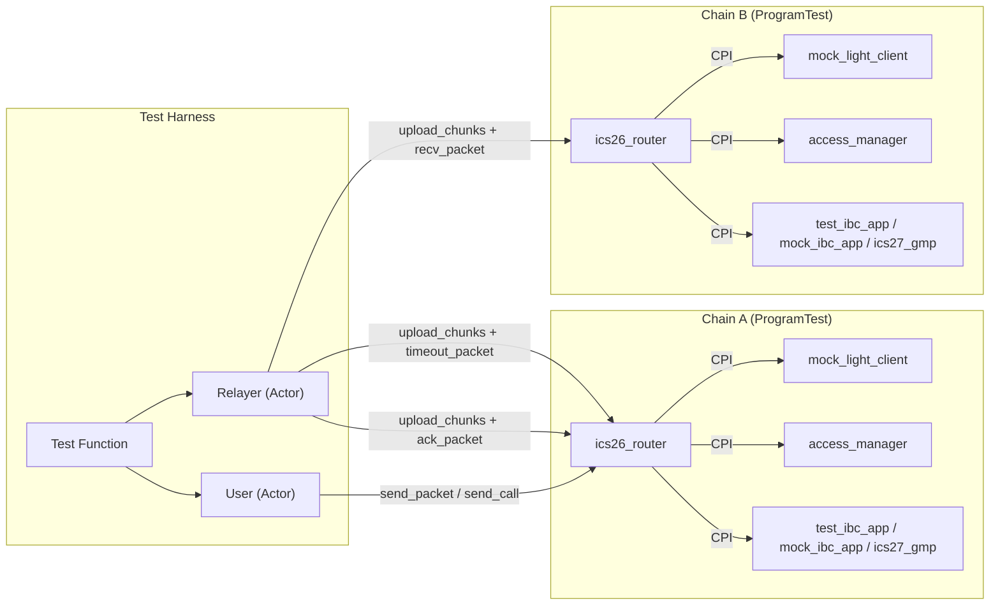
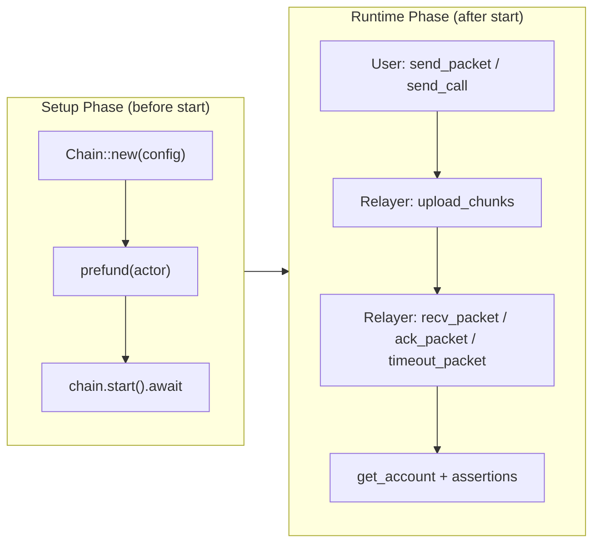
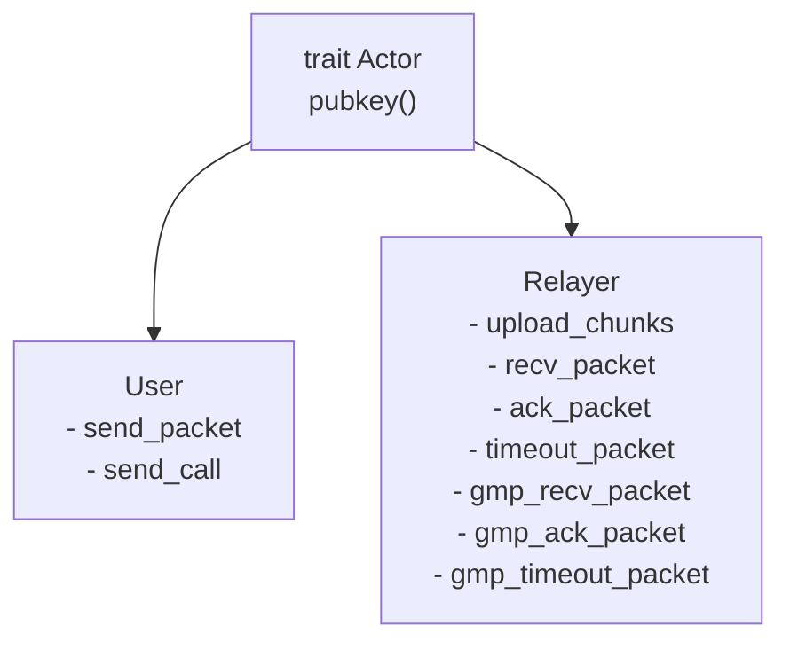
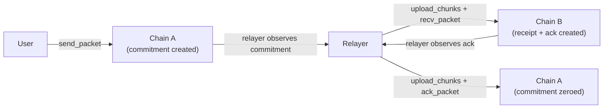
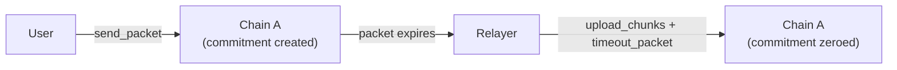
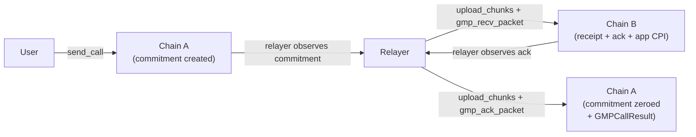
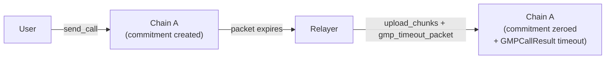

# Solana IBC Integration Tests

Solana-to-Solana IBC integration tests using `ProgramTest` (BanksClient). Two independent chains run as separate `ProgramTest` instances with a mock light client that always accepts proofs, exercising the full IBC lifecycle without real proof verification.

## Architecture



## Two-Phase Chain Lifecycle

Each `Chain` follows a setup-then-runtime lifecycle:



**Setup phase** — `ProgramTest` is configured with program binaries, `ProgramData` accounts (for upgrade authority verification) and pre-funded actors. No on-chain state exists yet.

**Runtime phase** — `start()` consumes the `ProgramTest`, produces a `BanksClient` and executes a sequence of real initialization transactions:

1. `access_manager::initialize` — creates the access manager account
2. `access_manager::grant_role` — grants `RELAYER_ROLE` and `ID_CUSTOMIZER_ROLE`
3. `ics26_router::initialize` — creates the router state
4. `mock_light_client::initialize` — creates client and consensus state accounts
5. `add_client` + `add_ibc_app` — registers the light client and IBC application
6. App-specific initialization (`test_ibc_app::initialize`, `ics27_gmp::initialize` + `test_gmp_app::initialize`, or nothing for `mock_ibc_app`)

After initialization, actors submit transactions and read account state.

## IBC Application Variants

The `IbcApp` enum selects which application is registered on the chain:

| Variant      | Programs loaded                    | Behavior                                                            |
| ------------ | ---------------------------------- | ------------------------------------------------------------------- |
| `TestIbcApp` | `test_ibc_app`                     | Stateful app that counts packets sent/received/acked/timed-out      |
| `MockIbcApp` | `mock_ibc_app`                     | Stateless app with magic-string ack control (`RETURN_ERROR_ACK` etc.) |
| `Gmp`        | `ics27_gmp` + `test_gmp_app`      | GMP stack with a counter app for cross-chain calls                  |

## Module Overview

| Module     | Purpose                                                                                              |
| ---------- | ---------------------------------------------------------------------------------------------------- |
| `chain`    | `Chain` struct with setup/runtime lifecycle, `ChainConfig`, `ChainAccounts`, `IbcApp` enum, real initialization sequence |
| `accounts` | `anchor_discriminator` and `account_owned_by` helpers                                                |
| `router`   | Instruction builders for `send_packet`, `recv_packet`, `ack_packet`, `timeout_packet`, chunk uploads |
| `gmp`      | Instruction builders for GMP `send_call`, `recv_packet`, `ack_packet`, `timeout_packet`              |
| `user`     | `User` actor — sends packets and GMP calls                                                           |
| `relayer`  | `Relayer` actor — uploads chunks and delivers recv/ack/timeout packets                               |

## Actors



Both actors wrap a `Keypair`. The `User` initiates IBC sends; the `Relayer` bridges packets between chains and holds the `RELAYER_ROLE` in the access manager.

## Packet Flow

Before each packet delivery, the relayer uploads payload and proof data to on-chain chunk PDAs via `upload_payload_chunk`/`upload_proof_chunk` transactions. The router reads those chunks during instruction execution.

### Router: send → recv → ack



### Router: send → timeout



### GMP: send_call → recv → ack



### GMP: send_call → timeout



## Test Matrix

| Test                               | File                  | Flow                                               |
| ---------------------------------- | --------------------- | -------------------------------------------------- |
| `test_full_packet_lifecycle`       | `router_lifecycle.rs` | send → recv → ack                                  |
| `test_bidirectional_packets`       | `router_lifecycle.rs` | A→B and B→A with different sequences               |
| `test_multiple_sequential_packets` | `router_lifecycle.rs` | 3 packets: send all → recv all → ack all           |
| `test_timeout_packet`              | `router_lifecycle.rs` | send → timeout                                     |
| `test_recv_packet_replay_is_noop`  | `router_lifecycle.rs` | recv same packet twice — second is noop            |
| `test_double_ack_fails`            | `router_lifecycle.rs` | ack same packet twice — second fails               |
| `test_double_timeout_fails`        | `router_lifecycle.rs` | timeout same packet twice — second fails           |
| `test_timeout_after_ack_fails`     | `router_lifecycle.rs` | ack then timeout on same packet — timeout fails    |
| `test_ack_after_timeout_fails`     | `router_lifecycle.rs` | timeout then ack on same packet — ack fails        |
| `test_error_ack_lifecycle`         | `router_lifecycle.rs` | send → recv (error ack via `MockIbcApp`) → ack     |
| `test_empty_ack_rejected`          | `router_lifecycle.rs` | recv with empty ack — rejected by router           |
| `test_multi_chunk_proof_lifecycle` | `router_lifecycle.rs` | send → recv → ack with proof split across chunks   |
| `test_proof_verification_failure`  | `router_lifecycle.rs` | recv with tampered proof — rejected by light client |
| `test_gmp_full_lifecycle`          | `gmp_lifecycle.rs`    | GMP send_call → recv (CPI into test_gmp_app) → ack |
| `test_gmp_timeout`                 | `gmp_lifecycle.rs`    | GMP send_call → timeout                            |

## Running

```bash
# Build all required .so binaries first
just build-solana

# Run all integration tests
cargo test -p integration-tests

# Run a specific test with logs
cargo test -p integration-tests test_full_packet_lifecycle -- --nocapture
```

Programs are loaded from `target/deploy/` via `SBF_OUT_DIR`. After modifying any program source, rebuild with `just build-solana <program>` before re-running tests.
