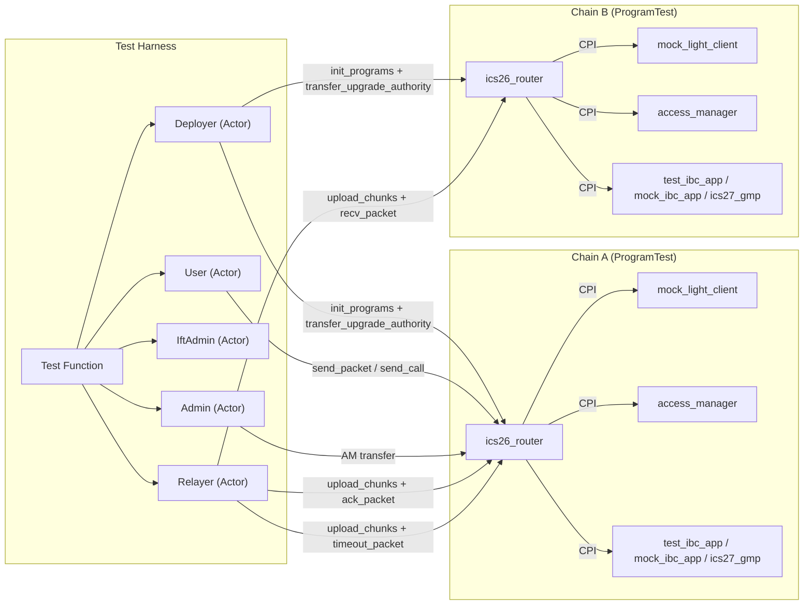
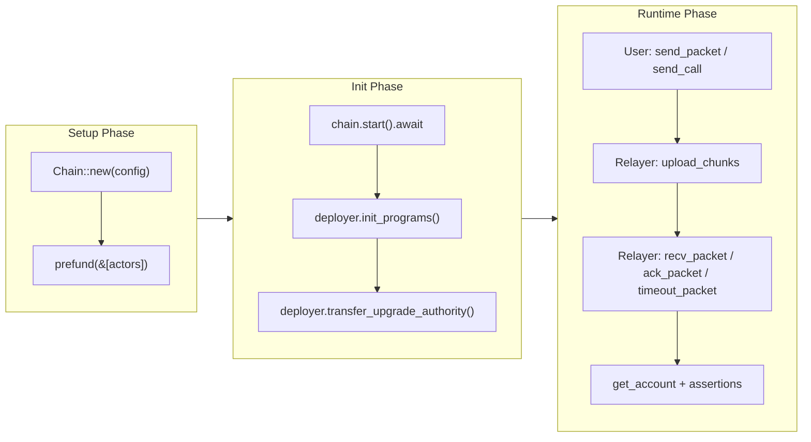
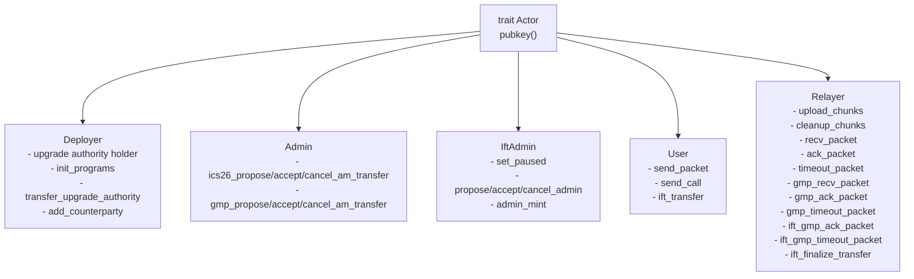
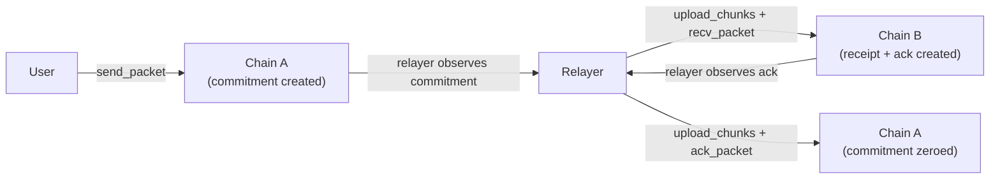
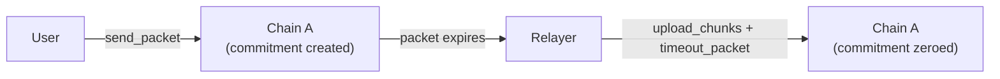
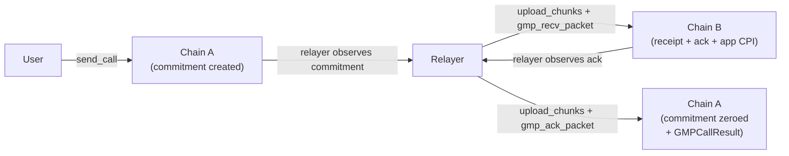
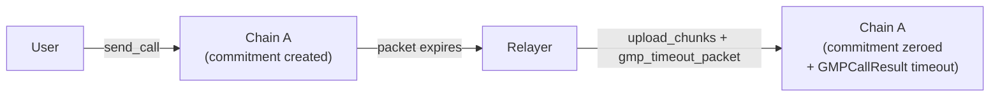
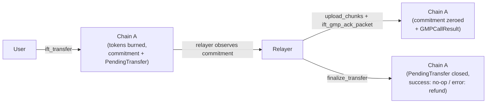

# Solana IBC Integration Tests

Solana-to-Solana IBC integration tests using `ProgramTest` (BanksClient).

Each chain is an isolated Solana runtime (`ProgramTest` → `BanksClient`) with the same programs deployed independently under identical program IDs. There is no real network between them — the relayer bridges state in-process by reading commitments from one `BanksClient` and submitting delivery transactions to the other. A mock light client accepts any proof, so tests focus on IBC state machine correctness rather than proof verification.

## Architecture



## Three-Phase Chain Lifecycle

Each `Chain` follows a setup → init → runtime lifecycle:



**Setup phase** — `Chain::new(config)` configures `ProgramTest` with program binaries and `ProgramData` accounts (for upgrade authority verification). Only the deployer is pre-funded automatically; other actors must be pre-funded explicitly via `chain.prefund(&[&admin, &relayer, &user])`. No on-chain state exists yet.

**Init phase** — `start()` consumes the `ProgramTest` and produces a `BanksClient`. Then `deployer.init_programs()` executes a sequence of real initialization transactions. The deployer signs upgrade-authority-gated steps; the admin signs AM-role-gated steps:

1. `access_manager::initialize` — creates the AM account with admin's pubkey as `ADMIN_ROLE` holder *(deployer signs)*
2. `access_manager::grant_role` — grants `RELAYER_ROLE` to relayer and `ID_CUSTOMIZER_ROLE` to admin *(admin signs)*
3. `ics26_router::initialize` — creates the router state *(deployer signs)*
4. `mock_light_client::initialize` — creates client and consensus state accounts
5. `add_client` + `add_ibc_app` — registers the light client and IBC application *(admin signs)*
6. App-specific initialization (`test_ibc_app::initialize`, `ics27_gmp::initialize` + `test_gmp_app::initialize`, `ift::initialize`, or nothing for `mock_ibc_app`) *(deployer signs)*

Finally, `deployer.transfer_upgrade_authority()` transfers upgrade authority of all programs to the access manager PDA so governance controls upgrades *(deployer signs)*.

**Runtime phase** — actors submit transactions and read account state.

## Program Variants

The `Program` enum lists programs to load onto a chain. IBC application variants register on a port and run initialization; auxiliary variants only load the binary.

| Variant        | Program loaded   | Port registration | Behavior                                                          |
| -------------- | ---------------- | ----------------- | ----------------------------------------------------------------- |
| `TestIbcApp`   | `test_ibc_app`   | Yes               | Stateful app that counts packets sent/received/acked/timed-out    |
| `MockIbcApp`   | `mock_ibc_app`   | Yes               | Stateless app with magic-string ack control (`RETURN_ERROR_ACK` etc.) |
| `Ics27Gmp`     | `ics27_gmp`      | Yes               | GMP IBC application on the GMP port                               |
| `TestGmpApp`   | `test_gmp_app`   | No                | Counter app invoked by GMP via CPI                                |
| `TestCpiProxy` | `test_cpi_proxy` | No                | Generic CPI proxy for security tests                              |
| `Ift`          | `ift`            | No                | Inter-chain fungible token transfers (uses GMP's port)            |
| `TestAccessManager` | `test_access_manager` | No           | Second AM instance for access manager migration tests             |

## Module Overview

| Module     | Purpose                                                                                              |
| ---------- | ---------------------------------------------------------------------------------------------------- |
| `chain`    | `Chain` struct with setup/runtime lifecycle, `ChainConfig`, `Program` enum and PDA derivation helpers. Init logic lives in `actors::deployer` |
| `accounts` | `anchor_discriminator` and `account_owned_by` helpers                                                |
| `actors`   | `Actor` trait and actor modules (`deployer`, `admin`, `ift_admin`, `user`, `relayer`)                 |
| `router`   | Instruction builders for `send_packet`, `recv_packet`, `ack_packet`, `timeout_packet`, chunk uploads, AM transfer (propose/accept/cancel) and `read_router_state` |
| `gmp`      | Instruction builders for GMP `send_call`, `recv_packet`, `ack_packet`, `timeout_packet`, raw `on_recv_packet` for security tests, AM transfer (propose/accept/cancel) and `read_gmp_app_state` |
| `ift`      | Instruction builders for IFT transfers, finalization, admin operations, pause, token creation (SPL and Token 2022), `TokenKind` enum and balance readers |

## Actors



All actors wrap a `Keypair`. `Deployer` holds the upgrade authority and orchestrates program initialization via `init_programs()`, then transfers upgrade authority to the access manager PDA via `transfer_upgrade_authority()`. For multi-hop tests, `add_counterparty()` registers additional client/counterparty pairs. `Admin` is an independent keypair whose pubkey is passed to the AM `initialize` instruction as the admin — it manages AM operations (role grants, AM transfers for ICS26 Router and GMP). `IftAdmin` manages IFT-specific admin operations (pause, admin transfer, minting) — a separate concern from the AM admin. `User` initiates IBC sends; `Relayer` bridges packets between chains and holds the `RELAYER_ROLE` in the access manager.

## Packet Flow

Before each packet delivery, the relayer uploads payload and proof data to on-chain chunk PDAs via `upload_payload_chunk`/`upload_proof_chunk` transactions. The router reads those chunks during instruction execution.

### Router: send → recv → ack



### Router: send → timeout



### GMP: send_call → recv → ack



### GMP: send_call → timeout



### IFT: transfer → ack → finalize



The IFT module supports both SPL Token and Token 2022 mints via the `TokenKind` enum. Tests use `setup_ift_chain` (SPL) or `setup_ift_chain_with_token` (either variant) to create a token, register an EVM bridge and mint an initial balance.

#### IFT Test Coverage

| Test | Scenario |
| --- | --- |
| `full_lifecycle` | Transfer → success ack → finalize (tokens stay burned) |
| `error_ack_refund` | Transfer → error ack → finalize (tokens refunded) |
| `timeout_refund` | Transfer → timeout → finalize (tokens refunded) |
| `batch_transfers` | Two consecutive transfers (seq 1 & 2), both acked and finalized |
| `token_2022_lifecycle` | Full lifecycle with Token 2022 mint (metadata extensions) |
| `admin_transfer` | Propose → accept admin; propose → cancel admin |
| `pause` | Pause blocks transfer + admin_mint; unpause restores them |

#### Admin Test Coverage

| Test | Scenario |
| --- | --- |
| `ics26_am_transfer_propose_accept` | Propose AM transfer on ICS26 Router, accept, verify `RouterState.am_state` updated |
| `ics26_am_transfer_propose_cancel` | Propose, cancel, verify pending cleared and AM unchanged |
| `ics26_am_transfer_unauthorized_propose` | Non-admin propose fails with `Unauthorized` |
| `gmp_am_transfer_propose_accept` | Propose AM transfer on GMP, accept, verify `GMPAppState.am_state` updated |
| `gmp_am_transfer_propose_cancel` | Propose, cancel on GMP |
| `gmp_am_transfer_unauthorized_propose` | Non-admin propose fails on GMP |

## Writing a New Test

A minimal router test that sends a packet from Chain A, delivers it to Chain B and acknowledges it back:

```rust
use super::*;

#[tokio::test]
async fn test_my_scenario() {
    // 1. Create actors
    let deployer = Deployer::new();
    let admin = Admin::new();
    let user = User::new();
    let relayer = Relayer::new();

    // 2. Configure chains with the programs they need
    let mut chain_a = Chain::new(ChainConfig {
        client_id: "a-client",
        counterparty_client_id: "b-client",
        deployer: &deployer,
        programs: &[Program::TestIbcApp],
    });
    chain_a.prefund(&[&admin, &relayer, &user]);

    let mut chain_b = Chain::new(ChainConfig {
        client_id: "b-client",
        counterparty_client_id: "a-client",
        deployer: &deployer,
        programs: &[Program::TestIbcApp],
    });
    chain_b.prefund(&[&admin, &relayer]);

    // 3. Start chains and initialize programs
    chain_a.start().await;
    deployer.init_programs(&mut chain_a, &admin, &relayer).await;
    deployer.transfer_upgrade_authority(&mut chain_a).await;
    chain_b.start().await;
    deployer.init_programs(&mut chain_b, &admin, &relayer).await;
    deployer.transfer_upgrade_authority(&mut chain_b).await;

    // 4. User sends a packet on Chain A
    let send = user
        .send_packet(
            &mut chain_a,
            SendPacketParams {
                sequence: 1,
                packet_data: b"hello",
                ..Default::default()
            },
        )
        .await
        .expect("send failed");

    assert_commitment_set(&chain_a, send.commitment_pda).await;

    // 5. Relayer uploads chunks and delivers to Chain B
    let (payload_pda, proof_pda) = relayer
        .upload_chunks(&mut chain_b, 1, b"hello", &[0u8; 32])
        .await
        .expect("upload failed");

    let recv = relayer
        .recv_packet(
            &mut chain_b,
            RecvPacketParams {
                sequence: 1,
                payload_chunk_pda: payload_pda,
                proof_chunk_pda: proof_pda,
                app_program: test_ibc_app::ID,
                ..Default::default()
            },
        )
        .await
        .expect("recv failed");

    assert_receipt_created(&chain_b, recv.receipt_pda).await;

    // 6. Relayer delivers ack back to Chain A
    let (ack_payload, ack_proof) = relayer
        .upload_chunks(&mut chain_a, 1, b"hello", &[0u8; 32])
        .await
        .expect("upload failed");

    let commitment_pda = relayer
        .ack_packet(
            &mut chain_a,
            AckPacketParams {
                sequence: 1,
                acknowledgement: br#"{"result": "AQ=="}"#.to_vec(),
                payload_chunk_pda: ack_payload,
                proof_chunk_pda: ack_proof,
                app_program: test_ibc_app::ID,
                ..Default::default()
            },
        )
        .await
        .expect("ack failed");

    assert_commitment_zeroed(&chain_a, commitment_pda).await;
}
```

Key patterns:

- **Setup before start** — `prefund` and program selection must happen before `chain.start().await`.
- **Three-step init** — after `start()`, call `deployer.init_programs()` then `deployer.transfer_upgrade_authority()`. For multi-hop, call `deployer.add_counterparty()` between the two.
- **Chunks before delivery** — every `recv_packet`, `ack_packet` and `timeout_packet` requires a preceding `upload_chunks` call.
- **`Default::default()`** — param structs implement `Default` for fields like `timeout_timestamp` and `proof_height`, so you only need to set what matters for your test.
- **Error assertions** — use `extract_custom_error` to match specific Anchor error codes instead of just checking that a transaction failed.

## Helper Functions

| Function | What it does | When to use |
| --- | --- | --- |
| `assert_commitment_set(chain, pda)` | Checks the commitment PDA has non-zero data | After `send_packet` to verify the commitment was stored |
| `assert_commitment_zeroed(chain, pda)` | Checks the commitment PDA was zeroed out | After `ack_packet` or `timeout_packet` to confirm consumption |
| `assert_receipt_created(chain, pda)` | Checks the receipt PDA exists and is owned by the router | After `recv_packet` to verify replay protection |
| `extract_ack_data(chain, pda)` | Reads the 32-byte ack commitment from a PDA | When you need to inspect the acknowledgement content |
| `extract_custom_error(err)` | Extracts the `u32` error code from a `BanksClientError` | When asserting a transaction failed with a specific Anchor error |
| `anchor_error_code(discriminant)` | Computes `6000 + discriminant` for an Anchor error variant | When constructing expected error codes from enum variants |

Pre-computed error constants are also available: `PACKET_COMMITMENT_MISMATCH`, `ASYNC_ACK_NOT_SUPPORTED`.

## Running

```bash
# Build all required .so binaries first
just build-solana

# Run all integration tests
cargo test -p integration-tests

# Run a specific test with logs
cargo test -p integration-tests test_full_packet_lifecycle -- --nocapture
```

Programs are loaded from `target/deploy/` via `SBF_OUT_DIR`. After modifying any program source, rebuild with `just build-solana <program>` before re-running tests.
