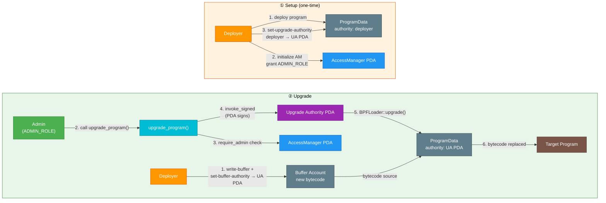
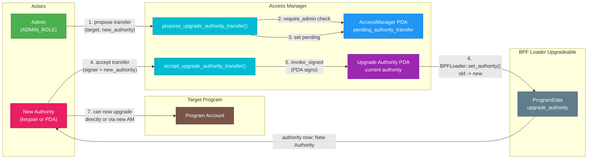

# Access Manager

Role-based access control for Solana IBC programs. Mirrors Ethereum's OpenZeppelin `AccessManager` pattern, providing unified governance over both runtime operations and program upgrades.

## Overview

The access manager maintains a central registry of roles and their members. Every permissioned operation across Solana IBC programs (relaying, pausing, upgrading) delegates authorization to this single account. It also controls program upgrade authority through PDAs, enabling role-based upgrades without exposing raw keypairs.

## State

```
AccessManager PDA (seeds: ["access_manager"])
  roles:                       Vec<RoleData>                      -- role ID -> member list
  whitelisted_programs:        Vec<Pubkey>                        -- programs allowed to call admin-gated instructions via CPI (e.g. multisig)
  pending_authority_transfer:  Option<PendingAuthorityTransfer>   -- pending two-step upgrade authority transfer
```

Role IDs are opaque `u64` values defined in `solana-ibc-types::roles`. The access manager does not interpret them -- consuming programs define what each role means.

## Instructions

### `initialize`

Creates the `AccessManager` PDA and sets the initial admin. Only callable by the program's upgrade authority (deployer). Rejects CPI.

### `grant_role` / `revoke_role`

Adds or removes an account from a role. Requires `ADMIN_ROLE`. The last admin cannot be removed.

### `renounce_role`

Allows an account to remove itself from a role. Does not require admin authorization.

### `set_whitelisted_programs`

Replaces the list of programs allowed to invoke admin-gated instructions via CPI. Requires `ADMIN_ROLE`.

### `upgrade_program`

Upgrades a target program's bytecode via BPF Loader Upgradeable. The access manager's PDA acts as the upgrade authority, signing the BPF Loader `Upgrade` call via `invoke_signed`. Requires `ADMIN_ROLE`. Allows whitelisted CPI.

### `propose_upgrade_authority_transfer`

Proposes transferring a target program's BPF Loader upgrade authority from this access manager's PDA to a new address. Sets a pending transfer on the `AccessManager` state. Requires `ADMIN_ROLE`. Allows whitelisted CPI. Only one pending transfer at a time.

### `accept_upgrade_authority_transfer`

Accepts a pending upgrade authority transfer by executing the BPF Loader `SetAuthority` CPI. Must be signed by the proposed new authority. No CPI restriction (supports both keypair signers and multisig/PDA callers).

This operation is irreversible from this access manager's perspective -- once accepted, only the new authority can upgrade the target program.

### `cancel_upgrade_authority_transfer`

Cancels a pending upgrade authority transfer. Requires `ADMIN_ROLE`. Allows whitelisted CPI.

## PDA Derivations

```
access_manager:    ["access_manager"]                              program: access_manager
upgrade_authority: ["upgrade_authority", target_program.as_ref()]   program: access_manager
program_data:      [target_program.as_ref()]                       program: BPF Loader Upgradeable
```

## Program Upgrade Flow

### Standard Upgrade via Access Manager



**Setup (one-time):**
1. Deploy programs with deployer keypair as upgrade authority
2. Initialize access manager, grant `ADMIN_ROLE`
3. Transfer each program's upgrade authority to the access manager's PDA via `solana program set-upgrade-authority`

**Upgrade flow:**
1. Write new bytecode to a buffer account
2. Set buffer authority to the access manager's upgrade authority PDA
3. Call `upgrade_program()` with an admin signer -- the PDA signs the BPF Loader CPI

### Authority Transfer (Two-Step Propose/Accept)

When migrating to a new access manager or transferring upgrade control, the transfer uses a two-step propose/accept pattern to prevent irreversible mistakes:



The admin can also call `cancel_upgrade_authority_transfer` to abort a pending proposal before the new authority accepts.

### AM-to-AM Migration (Future Work)

The current transfer flow supports any signer as the new authority (keypair or multisig). Migrating to a **second Access Manager instance** (AM-B) is a special case that would require a new instruction.

#### PDA signing gap

To transfer authority to AM-B's upgrade authority PDA, that PDA must sign the accept transaction. But PDAs can only sign via `invoke_signed` from the program that owns them. AM-B would need a dedicated `claim_upgrade_authority` instruction that CPIs into AM-A's `accept_upgrade_authority_transfer` and signs with AM-B's own upgrade authority PDA.

The `accept_upgrade_authority_transfer` instruction has no CPI restriction, so AM-B's `claim_upgrade_authority` could call it without being whitelisted. The underlying BPF Loader `SetAuthority` mechanics are identical regardless of whether the new authority is a keypair or a PDA.

## Security

#### CPI validation

`require_admin` checks the instructions sysvar to validate the caller. Direct calls and whitelisted CPI are allowed; unauthorized and nested CPI are rejected.

#### Sysvar address constraint

The instructions sysvar account has an `address` constraint preventing fake sysvar attacks (Wormhole-style).

#### Two-step authority transfer

Authority transfers require propose + accept, preventing irreversible mistakes from a single admin action.

#### Zero-address rejection

`propose_upgrade_authority_transfer` rejects `Pubkey::default()` to prevent irreversible lockout.

#### Self-transfer rejection

`propose_upgrade_authority_transfer` rejects transferring to the current upgrade authority PDA.

#### Last admin protection

The last admin cannot be removed via `revoke_role`.

#### Per-program PDA scoping

Upgrade authority PDAs include the target program ID in their seeds, preventing cross-program authority reuse.

## Testing

### Unit and Integration Tests

```bash
just build-solana access-manager
cargo test -p access-manager --lib --tests
```

The test suite includes Mollusk (SBF binary) unit tests and ProgramTest integration tests covering admin authorization, CPI rejection, fake sysvar attacks, wrong PDA derivation and zero-address rejection.

### E2E Tests

Tests are in `e2e/interchaintestv8/solana_upgrade_test.go`:
- `Test_ProgramUpgrade_Via_AccessManager` -- standard upgrade flow
- `Test_RevokeAdminRole` -- revoked admin cannot upgrade
- `Test_TransferUpgradeAuthority` -- two-step propose/accept authority transfer and migration verification

### E2E Limitations

#### No AM-to-AM migration coverage

The authority transfer e2e test validates the propose/accept flow with a keypair as the new authority, which exercises the same BPF Loader `SetAuthority` mechanics that an AM-to-AM migration would use. Testing with a second AM instance is not covered because:

1. Anchor's `declare_id!` bakes the program ID into the `.so` binary at compile time -- deploying two AM instances requires building two separate binaries with different `declare_id!` values
2. The `claim_upgrade_authority` instruction needed for AM-B to sign the accept transaction does not exist yet (see [AM-to-AM Migration](#am-to-am-migration-future-work))
3. E2E test infrastructure would need to deploy and initialize both AM instances
