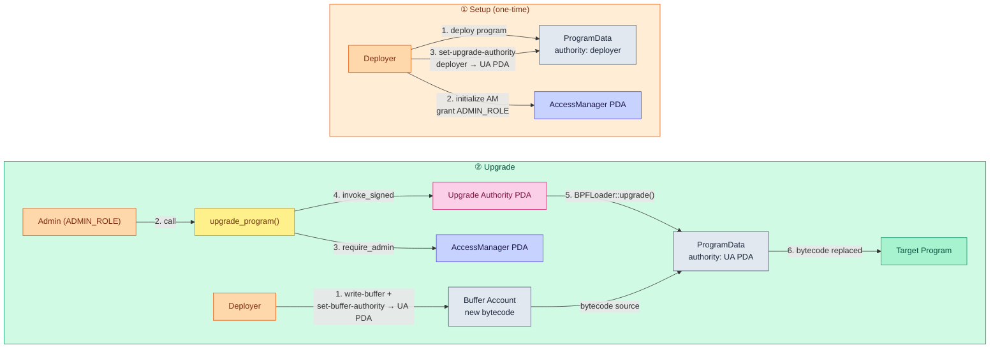
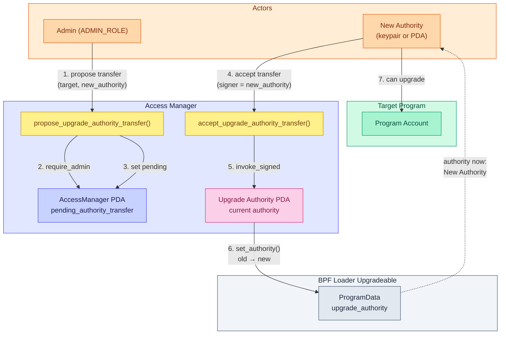
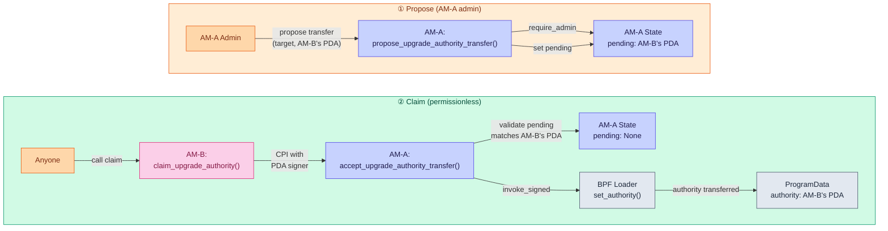
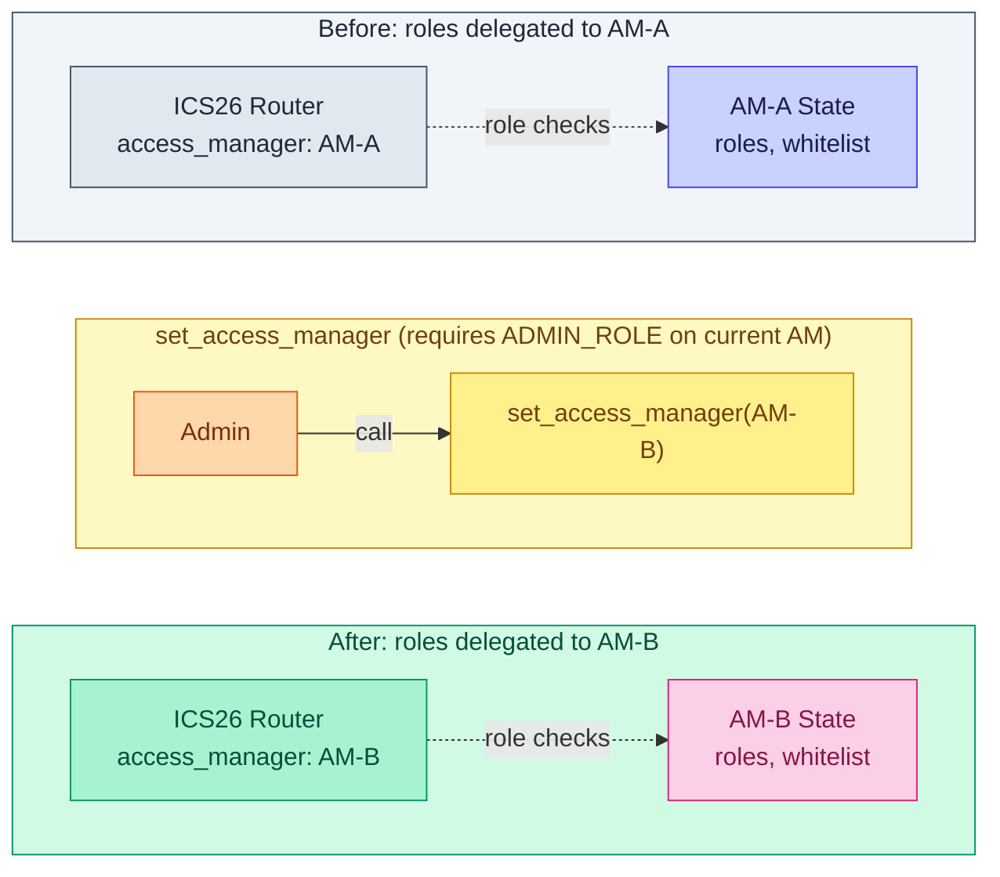

# Access Manager

Role-based access control for Solana IBC programs. Mirrors Ethereum's OpenZeppelin `AccessManager` pattern, providing unified governance over both runtime operations and program upgrades.

## Overview

The access manager maintains a central registry of roles and their members. Every permissioned operation across Solana IBC programs (relaying, pausing, upgrading) delegates authorization to this single account. It also controls program upgrade authority through PDAs, enabling role-based upgrades without exposing raw keypairs.

## State

```
AccessManager PDA (seeds: ["access_manager"])
  roles:                       Vec<RoleData>                      -- role ID -> member list
  whitelisted_programs:        Vec<Pubkey>                        -- programs allowed to call admin-gated instructions via CPI (e.g. multisig)
  pending_authority_transfer:  Option<PendingAuthorityTransfer>   -- pending two-step upgrade authority transfer
```

Role IDs are opaque `u64` values defined in `solana-ibc-types::roles`. The access manager does not interpret them -- consuming programs define what each role means.

## Instructions

### `initialize`

Creates the `AccessManager` PDA and sets the initial admin. Only callable by the program's upgrade authority (deployer). Rejects CPI.

### `grant_role` / `revoke_role`

Adds or removes an account from a role. Requires `ADMIN_ROLE`. The last admin cannot be removed.

### `renounce_role`

Allows an account to remove itself from a role. Does not require admin authorization.

### `set_whitelisted_programs`

Replaces the list of programs allowed to invoke admin-gated instructions via CPI. Requires `ADMIN_ROLE`.

### `upgrade_program`

Upgrades a target program's bytecode via BPF Loader Upgradeable. The access manager's PDA acts as the upgrade authority, signing the BPF Loader `Upgrade` call via `invoke_signed`. Requires `ADMIN_ROLE`. Allows whitelisted CPI.

### `propose_upgrade_authority_transfer`

Proposes transferring a target program's BPF Loader upgrade authority from this access manager's PDA to a new address. Sets a pending transfer on the `AccessManager` state. Requires `ADMIN_ROLE`. Allows whitelisted CPI. Only one pending transfer at a time.

### `accept_upgrade_authority_transfer`

Accepts a pending upgrade authority transfer by executing the BPF Loader `SetAuthority` CPI. Must be signed by the proposed new authority. No CPI restriction (supports both keypair signers and multisig/PDA callers).

This operation is irreversible from this access manager's perspective -- once accepted, only the new authority can upgrade the target program.

### `cancel_upgrade_authority_transfer`

Cancels a pending upgrade authority transfer. Requires `ADMIN_ROLE`. Allows whitelisted CPI.

### `claim_upgrade_authority`

Claims upgrade authority from a source access manager that has proposed a transfer to this access manager's upgrade authority PDA. CPIs into the source AM's `accept_upgrade_authority_transfer` with this AM's PDA as signer. No admin authorization required -- PDA signing is the authorization.

## PDA Derivations

```
access_manager:    ["access_manager"]                              program: access_manager
upgrade_authority: ["upgrade_authority", target_program.as_ref()]   program: access_manager
program_data:      [target_program.as_ref()]                       program: BPF Loader Upgradeable
```

## Program Upgrade Flow

### Standard Upgrade via Access Manager



**Setup (one-time):**
1. Deploy programs with deployer keypair as upgrade authority
2. Initialize access manager, grant `ADMIN_ROLE`
3. Transfer each program's upgrade authority to the access manager's PDA via `solana program set-upgrade-authority`

**Upgrade flow:**
1. Write new bytecode to a buffer account
2. Set buffer authority to the access manager's upgrade authority PDA
3. Call `upgrade_program()` with an admin signer -- the PDA signs the BPF Loader CPI

### Authority Transfer (Two-Step Propose/Accept)

When migrating to a new access manager or transferring upgrade control, the transfer uses a two-step propose/accept pattern to prevent irreversible mistakes:



The admin can also call `cancel_upgrade_authority_transfer` to abort a pending proposal before the new authority accepts.

### AM-to-AM Migration

Replacing one access manager instance (AM-A) with another (AM-B) requires migrating two independent control planes:

| Control plane | What it governs | Where it's stored | How to migrate |
|---|---|---|---|
| **Upgrade authority** | Who can replace program bytecode | BPF Loader's `ProgramData.upgrade_authority` | `propose` + `claim_upgrade_authority` (per managed program) |
| **Runtime roles** | Who can relay, pause, admin-gate operations | Each IBC program's state (e.g. `RouterState.access_manager`) | `set_access_manager` (per IBC program) |

These are fully independent -- migrating one does not affect the other.

#### Upgrade authority migration

AM-B's upgrade authority PDA must sign the accept transaction, but PDAs can only sign via `invoke_signed` from their owning program. The `claim_upgrade_authority` instruction solves this:



Repeat for each managed program (ICS07, ICS26, GMP, etc.). No admin role is required on the claim side -- PDA signing is the authorization.

#### Runtime role migration

Each IBC program (ICS07, ICS26, GMP, attestation) stores an `access_manager: Pubkey` field in its state that points to the access manager it delegates role checks to. Calling `set_access_manager` on each program repoints it from AM-A to AM-B:



Repeat for each IBC program. IFT uses a different pattern (`admin: Pubkey` with two-step propose/accept transfer) and does not use `set_access_manager`.

> **Future improvement:** `set_access_manager` is currently a one-step operation. If an admin accidentally points it to a wrong or nonexistent AM address, the program becomes unrecoverable through normal admin operations -- all future admin-gated calls (including another `set_access_manager` to fix the mistake) would fail because `require_admin` reads roles from the now-invalid AM. A two-step propose/accept pattern (similar to upgrade authority transfer) would prevent this: the admin proposes a new AM, and then someone with `ADMIN_ROLE` on the *new* AM accepts, proving it is valid and operational before the switch takes effect.

#### Full migration checklist

Assuming AM-B is already deployed and initialized with its own admin:

1. **AM-A admin proposes upgrade authority transfers** -- call `propose_upgrade_authority_transfer` on AM-A for each managed program, specifying AM-B's upgrade authority PDA as the new authority
2. **Anyone claims on AM-B** -- call `claim_upgrade_authority` on AM-B for each program (permissionless, PDA signing is the authorization)
3. **Verify upgrade authority** -- confirm each program's `ProgramData.upgrade_authority` now points to AM-B's PDA
4. **Repoint runtime roles** -- call `set_access_manager` on each IBC program (ICS07, ICS26, GMP, attestation) to point at AM-B. This requires `ADMIN_ROLE` on whichever AM currently controls the program
5. **Verify runtime roles** -- confirm AM-B admin can perform role-gated operations (e.g. grant roles, relay packets)
6. **Migrate IFT admin** (if applicable) -- use IFT's `propose_admin_transfer` + `accept_admin_transfer`

After migration, AM-A has no remaining authority over any program. AM-B controls both bytecode upgrades and runtime roles.

## Security

#### CPI validation

`require_admin` checks the instructions sysvar to validate the caller. Direct calls and whitelisted CPI are allowed; unauthorized and nested CPI are rejected.

#### Sysvar address constraint

The instructions sysvar account has an `address` constraint preventing fake sysvar attacks (Wormhole-style).

#### Two-step authority transfer

Authority transfers require propose + accept, preventing irreversible mistakes from a single admin action.

#### Zero-address rejection

`propose_upgrade_authority_transfer` rejects `Pubkey::default()` to prevent irreversible lockout.

#### Self-transfer rejection

`propose_upgrade_authority_transfer` rejects transferring to the current upgrade authority PDA.

#### Last admin protection

The last admin cannot be removed via `revoke_role`.

#### Per-program PDA scoping

Upgrade authority PDAs include the target program ID in their seeds, preventing cross-program authority reuse.

## Testing

### Unit and Integration Tests

```bash
just build-solana access-manager
cargo test -p access-manager --lib --tests
```

The test suite includes Mollusk (SBF binary) unit tests and ProgramTest integration tests covering admin authorization, CPI rejection, fake sysvar attacks, wrong PDA derivation and zero-address rejection.

### E2E Tests

Tests are in `e2e/interchaintestv8/solana_upgrade_test.go`:
- `Test_ProgramUpgrade_Via_AccessManager` -- standard upgrade flow
- `Test_RevokeAdminRole` -- revoked admin cannot upgrade
- `Test_TransferUpgradeAuthority` -- two-step propose/accept authority transfer and migration verification
- `Test_AMtoAM_UpgradeAuthorityMigration` -- full AM-to-AM migration via propose + claim
