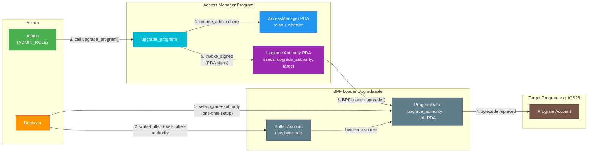
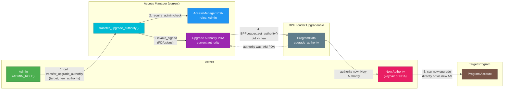

# Access Manager

Role-based access control for Solana IBC programs. Mirrors Ethereum's OpenZeppelin `AccessManager` pattern, providing unified governance over both runtime operations and program upgrades.

## Overview

The access manager maintains a central registry of roles and their members. Every permissioned operation across Solana IBC programs (relaying, pausing, upgrading) delegates authorization to this single account. It also controls program upgrade authority through PDAs, enabling role-based upgrades without exposing raw keypairs.

## State

```
AccessManager PDA (seeds: ["access_manager"])
  roles:                Vec<RoleData>   -- role ID -> member list
  whitelisted_programs: Vec<Pubkey>     -- programs allowed to call admin-gated instructions via CPI (e.g. multisig)
```

Role IDs are opaque `u64` values defined in `solana-ibc-types::roles`. The access manager does not interpret them -- consuming programs define what each role means.

## Instructions

### `initialize`

Creates the `AccessManager` PDA and sets the initial admin. Only callable by the program's upgrade authority (deployer). Rejects CPI.

### `grant_role` / `revoke_role`

Adds or removes an account from a role. Requires `ADMIN_ROLE`. The last admin cannot be removed.

### `renounce_role`

Allows an account to remove itself from a role. Does not require admin authorization.

### `set_whitelisted_programs`

Replaces the list of programs allowed to invoke admin-gated instructions via CPI. Requires `ADMIN_ROLE`.

### `upgrade_program`

Upgrades a target program's bytecode via BPF Loader Upgradeable. The access manager's PDA acts as the upgrade authority, signing the BPF Loader `Upgrade` call via `invoke_signed`. Requires `ADMIN_ROLE`. Allows whitelisted CPI.

### `transfer_upgrade_authority`

Transfers a target program's BPF Loader upgrade authority from this access manager's PDA to a new address (keypair or another PDA). This enables access manager migration. Requires `ADMIN_ROLE`. Allows whitelisted CPI.

This operation is irreversible from this access manager's perspective -- once transferred, only the new authority can upgrade the target program.

## PDA Derivations

```
access_manager:    ["access_manager"]                              program: access_manager
upgrade_authority: ["upgrade_authority", target_program.as_ref()]   program: access_manager
program_data:      [target_program.as_ref()]                       program: BPF Loader Upgradeable
```

## Program Upgrade Flow

### Standard Upgrade via Access Manager



**Setup (one-time):**
1. Deploy programs with deployer keypair as upgrade authority
2. Initialize access manager, grant `ADMIN_ROLE`
3. Transfer each program's upgrade authority to the access manager's PDA via `solana program set-upgrade-authority`

**Upgrade flow:**
1. Write new bytecode to a buffer account
2. Set buffer authority to the access manager's upgrade authority PDA
3. Call `upgrade_program()` with an admin signer -- the PDA signs the BPF Loader CPI

### Authority Transfer (Access Manager Migration)

When migrating to a new access manager or transferring upgrade control, `transfer_upgrade_authority` has the current AM's PDA sign a BPF Loader `SetAuthority` call.



BPF Loader `SetAuthority` account ordering:
1. `programdata_address` (writable, non-signer)
2. `current_authority_address` (read-only, signer via PDA)
3. `new_authority_address` (read-only, non-signer -- uses unchecked variant for PDA targets)

## Security

- **CPI validation**: `require_admin` checks the instructions sysvar to validate the caller. Direct calls and whitelisted CPI are allowed; unauthorized and nested CPI are rejected.
- **Sysvar address constraint**: The instructions sysvar account has an `address` constraint preventing fake sysvar attacks (Wormhole-style).
- **Zero-address rejection**: `transfer_upgrade_authority` rejects `Pubkey::default()` to prevent irreversible lockout.
- **Last admin protection**: The last admin cannot be removed via `revoke_role`.
- **Per-program PDA scoping**: Upgrade authority PDAs include the target program ID in their seeds, preventing cross-program authority reuse.

## Testing

```bash
just build-solana access-manager
cargo test -p access-manager --lib --tests
```

The test suite includes Mollusk (SBF binary) unit tests and ProgramTest integration tests covering admin authorization, CPI rejection, fake sysvar attacks, wrong PDA derivation and zero-address rejection.

E2E tests are in `e2e/interchaintestv8/solana_upgrade_test.go`:
- `Test_ProgramUpgrade_Via_AccessManager` -- standard upgrade flow
- `Test_RevokeAdminRole` -- revoked admin cannot upgrade
- `Test_TransferUpgradeAuthority` -- authority transfer and migration verification
